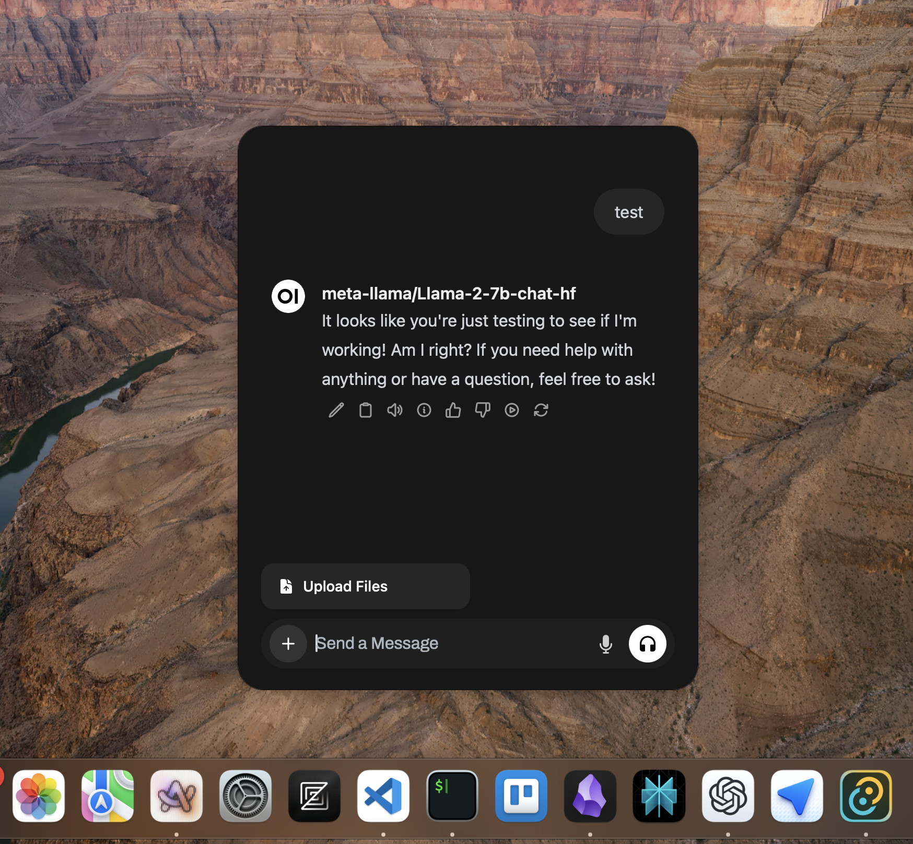

# Open WebUI Desktop

**Early stages, WIP, unstable, currnetly incompatible with non-local setups.** Desktop app for Open WebUI, the popular self-hosted LLM WebUI. Built using Tauri 2 and hot-glued Svelte code from the front-end [Open WebUI](https://github.com/open-webui/open-webui).

## Screenshots

Panel-inspired look for Open WebUI on the desktop

Always on top ChatGPT and Spotlight inspired chatbar. Global hotkey is currently hardcoded to _Ctrl+Space_. Pressing _Esc_ or losing focus hides the window.

Send a message in the chatbar and the chat companion will keep that chat available for 10 minutes after the most recent message. Currently a hardcoded value. It also retains its position on the screen.

## Installing

1. Have modern `rust`, Python 3.11 (preferably as a venv) and any Node.js package manager compatible with `package.json`, I used `npm` or `deno`
1. Clone this repo
1. Run `tauri run dev` and begin the long first build process
1. Clone [Open WebUI](https://github.com/open-webui/open-webui)
1. Follow their instructions to start **only the backend dev server**
1. By the time this is done the app should launch and greet you with the Open WebUI setup screen.

## Roadmap (roughly in order)

- Support non-local setups
- Slight UI extensions to chatbar (temporary chat switch, model selector, close button, new chat button)
- Full support of Open WebUI on the desktop
- Customizable app options: global hotkey, companion chat settings, chatbar position, etc.
- Match styling guidelines of Mac, Windows, Linux (NSPanel and Window Effects)
- Distribution
- Modularize `Chat.svelte` code and conform to TypeScript
- Mirror ChatGPT Desktop's useful system integrations: clipboard, screenshot, app context

## Contributing

No guidelines at the moment; I quickly will review and integrate useful contributions.
